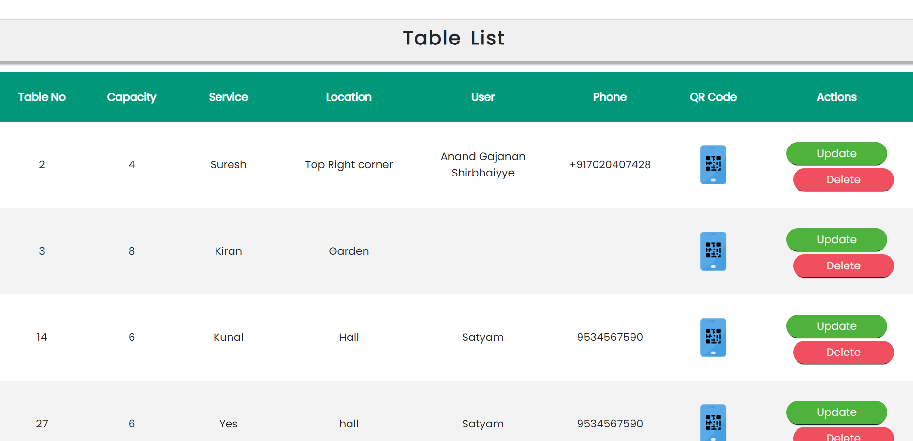

# namaste-pos

## User Side

1. **User Registration and Login:**

* Users need to sign up or log in to access the features of the platform.
* You can implement user authentication using a username and password or other methods like email verification or social media login.

2. **Homepage:**

After logging in, users are directed to the homepage where they see two options: **Menu** and **Book Table**.

3. **Book Table:**

If the user wants to dine in at a restaurant, they can select the **Book Table** option.

**4. Menu:**

If the user does not want to book a table and wants to order food directly, they can select the **Menu** option.

The menu page displays different food categories (e.g., Dosas, Sandwich, Burger..).

Users can click on each category to view the items available in that category.

5. **Item Details:**

When a user clicks on a specific item, they can see the details of that item, such as the name, description, price, and possibly an image.

6. **Add to Cart:**

* Users can add items to their cart by clicking the **Add to Cart** button on the item's details page.

* The selected items are added to the user's cart or order list.

7. **Order Confirmation:**

* Once the user has added all the desired items to their cart, they can proceed to the order confirmation page.

* The order confirmation page displays a summary of the selected items, their quantities, and the total cost.

8. **Place Order:**

* After confirming the order details, the user can proceed to place the order.

You can integrate with a payment gateway or provide options for cash on delivery or other payment methods.

On successful order placement, you can store the order details in the database and provide a confirmation to the user.

## Admin Side 

1. **Admin Dashboard:**

Upon logging in as an administrator, you are directed to the admin dashboard.

The dashboard serves as a central hub for managing various aspects of the platform.

2. **Add Product:**

* In the admin dashboard, you have an option to add a new product.

* Clicking on the **Add Product** button takes you to a form where you can enter the details of the new product.

* You can include fields such as product **name**, **description**, **price**, **category**, and any other relevant information.

* Upon submission, the new product is added to the database and becomes available in the menu for users.

3. **Add Table:**

* The **Add Table** option allows you to add a new table to the restaurant's inventory.

* Clicking on this option takes you to a form where you can enter the table details, such as table **number**, **seating capacity**, and any additional information.

* After submitting the form, the new table is stored in the database for later use.

4. **Product List:**

* By clicking on the **Product List** option in the admin dashboard, you can view all the products available in the system.

* The product list provides an overview of the **products**, **including their names**, **descriptions**, **prices**, and **categories**.

* You can also implement functionalities such as editing or deleting products from this list

5. **Table List:**

* Similarly, the **Table List** option in the admin dashboard allows you to view all the tables in the restaurant's inventory.

* The table list displays information such as table numbers, seating capacities, and availability status.

* You can perform actions like editing table details or deleting tables from this list.

6. **QR Code Generation:**

* In the table list, there is an option to generate QR codes for each table.

* By clicking on the **Download QR Code** option for a specific table, you can generate a unique QR code for that table.
The QR code can be downloaded and printed or displayed in the restaurant area.

* Customers can then scan the QR code using their mobile devices to access the table's menu or other relevant information.

7. **Scanner:**

* The scanner functionality is used by the restaurant staff to scan the QR codes at tables.

* By scanning the QR code, the staff can identify the specific table associated with that code.

* This information helps in serving the correct orders to the respective tables.

*. **Other Administrative Tasks:**

* The admin panel may offer additional functionalities depending on the specific requirements of your project.

* This could include managing user accounts, handling restaurant information, viewing order history, managing reviews and ratings, etc.